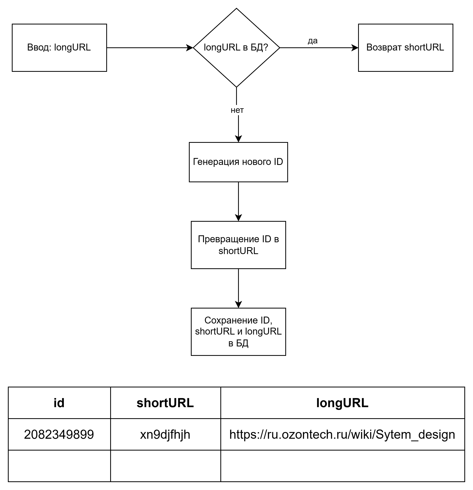

# URLShortyGo
URLShorty is a URL shortening service implemented in Go. It allows users to shorten long URLs into shorter, more manageable links.

## Заполнение конфигов:
1. Заполнить файл .env.example и переименовать в .env
2. Использовать configs/configs.go для заполнения конфигов

## Запуск сервиса локально:
1. Запуск сервера
```shell
  go run cmd/main.go
```
2. Миграции в базу данных
```shell
  make migrate-up
```

## Запуск сервиса через Docker:
1. Запуск Docker-compose
```shell
  docker compose up
```
2. Миграции в базу данных
```shell
  make migrate-up
```

## Пример запросов к сервису:
POST /make-short-url?url=https://www.google.com
Response: 
```
    4gT7zf1Wch
```

GET /get-long-url?url=4gT7zf1Wch
Response: 
```
    https://www.google.com
```


